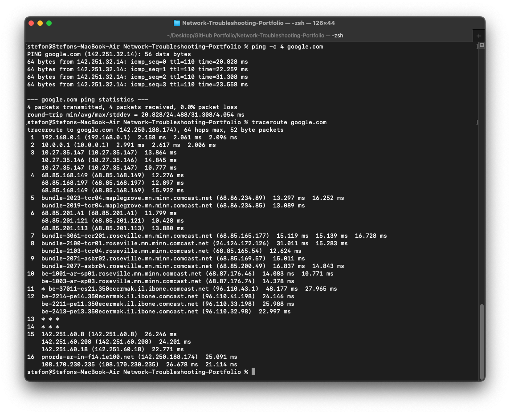

# Scenario 01 — IP Configuration and Connectivity

## Objective

Verify a workstation's local network configuration, default gateway connectivity, Internet connectivity, DNS resolution, 
and network path.

## Environment

- Host OS: macOS
- Connection: Wi-Fi
- Active interface: en0
- IPv4 address: 192.168.0.88
- Subnet mask: 255.255.255.0 (/24)
- Default gateway: 192.168.0.1
- DNS server: 192.168.0.1

## Troubleshooting Process

### 1. Identify the Active Interface

The default route and available network interfaces were inspected.

The active network interface was identified as:

    en0

The default gateway was:

    192.168.0.1

### 2. Verify IP Configuration

The workstation reported:

    IP Address: 192.168.0.88
    Subnet Mask: 255.255.255.0
    Default Gateway: 192.168.0.1
    DNS Server: 192.168.0.1

The address is within the same /24 network as the default gateway.

### 3. Test Local Gateway Connectivity

Command:

    ping -c 4 192.168.0.1

Result:

- 4 packets transmitted
- 4 packets received
- 0.0% packet loss
- Average latency approximately 2.9 ms

This verified connectivity between the workstation and local router.

### 4. Test Internet Connectivity

Command:

    ping -c 4 8.8.8.8

Result:

- 4 packets transmitted
- 4 packets received
- 0.0% packet loss
- Average latency approximately 24 ms

This demonstrated Internet connectivity without relying on DNS name resolution.

### 5. Test DNS Resolution

Command:

    nslookup google.com

The configured DNS server successfully resolved google.com to an IPv4 address.

This verified that DNS resolution was functioning.

### 6. Test Hostname Connectivity

Command:

    ping -c 4 google.com

Result:

- 4 packets transmitted
- 4 packets received
- 0.0% packet loss
- Average latency approximately 24.5 ms

This confirmed both DNS resolution and end-to-end connectivity.

### 7. Trace the Network Path

Command:

    traceroute google.com

The trace successfully progressed from the local gateway through multiple upstream network hops and reached the 
destination.

Some intermediate hops returned `* * *`. This does not necessarily indicate a connectivity failure because routers may 
ignore or filter traceroute probes while continuing to forward traffic.

## Diagnosis

No network fault was detected.

The workstation had:

- A valid local IPv4 configuration
- A reachable default gateway
- Working Internet connectivity
- Working DNS resolution
- Successful hostname connectivity
- A functioning route to the remote destination

## Evidence

## Skills Demonstrated

- TCP/IP troubleshooting
- IPv4 configuration analysis
- Default gateway testing
- ICMP connectivity testing
- DNS troubleshooting
- Network path analysis
- macOS network administration
- Structured troubleshooting documentation
