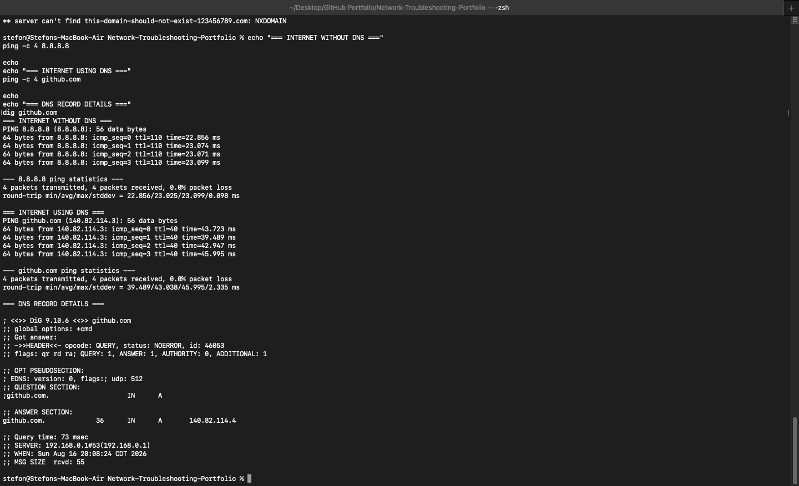

# Scenario 02 — DNS Troubleshooting

## Objective

Verify DNS configuration and determine whether a workstation can successfully resolve domain names using the local DNS server and public DNS resolvers.

## Environment

- Platform: macOS
- Network Interface: Wi-Fi
- Local DNS Server: 192.168.0.1
- Public DNS Servers Tested:
  - Google DNS — 8.8.8.8
  - Cloudflare DNS — 1.1.1.1
- Test Domain: github.com

## Troubleshooting Process

### 1. Check Current DNS Configuration

The active DNS configuration was inspected to identify the DNS server being used by the workstation.

```bash
scutil --dns | grep 'nameserver\[[0-9]*\]'
```

The workstation was using `192.168.0.1` as its local DNS resolver.

### 2. Test the Default DNS Server

The configured DNS server was tested by resolving `github.com`.

```bash
nslookup github.com
```

The local DNS server successfully returned an IP address for GitHub.

This confirmed that the configured DNS resolver was functioning correctly.

### 3. Test Google Public DNS

Google Public DNS was tested directly to verify that an alternative DNS resolver could successfully resolve the same hostname.

```bash
nslookup github.com 8.8.8.8
```

Google Public DNS successfully resolved `github.com`.

### 4. Test Cloudflare Public DNS

Cloudflare DNS was also tested as a second external resolver.

```bash
nslookup github.com 1.1.1.1
```

Cloudflare DNS successfully resolved `github.com`.

Testing multiple DNS servers helps determine whether a DNS problem is isolated to the workstation's configured resolver or affects DNS resolution more broadly.

### 5. Test an Invalid Domain

A deliberately invalid hostname was queried to verify that the DNS server correctly handles nonexistent domains.

```bash
nslookup this-domain-should-not-exist-123456789.com
```

The DNS server returned:

```text
NXDOMAIN
```

This is the expected result for a nonexistent domain and demonstrates the difference between successful DNS resolution and a legitimate DNS lookup failure.

### 6. Verify Internet Connectivity Without DNS

An external IP address was pinged directly.

```bash
ping -c 4 8.8.8.8
```

Result:

- 4 packets transmitted
- 4 packets received
- 0% packet loss

Successful communication with an IP address confirms that basic Internet connectivity works without requiring hostname resolution.

### 7. Verify Internet Connectivity Using DNS

A hostname was then used instead of an IP address.

```bash
ping -c 4 github.com
```

Result:

- 4 packets transmitted
- 4 packets received
- 0% packet loss

The hostname successfully resolved to an IP address and responded to all four ICMP requests.

This confirmed that both DNS resolution and Internet connectivity were operational.

### 8. Inspect DNS Record Details

The `dig` utility was used to inspect the DNS query in greater detail.

```bash
dig github.com
```

The DNS query returned:

```text
status: NOERROR
```

An IPv4 A record for `github.com` was successfully returned.

The query also confirmed that the DNS server handling the request was `192.168.0.1`.

## Diagnosis

No DNS fault was detected.

Testing confirmed:

- A valid local DNS resolver
- Successful hostname resolution using the local DNS server
- Successful resolution using Google Public DNS
- Successful resolution using Cloudflare Public DNS
- Correct NXDOMAIN handling for a nonexistent domain
- Working Internet connectivity without DNS
- Working Internet connectivity using a hostname
- Successful DNS A-record queries

## Troubleshooting Logic

If an IP address such as `8.8.8.8` is reachable but a hostname such as `github.com` cannot be resolved, DNS should be investigated.

Possible DNS-related causes could include:

- Incorrect DNS server configuration
- Unreachable DNS server
- DNS resolver failure
- Incorrect manual DNS settings
- Local DNS cache problems
- Router DNS problems
- Upstream DNS service issues

If neither an external IP address nor a hostname is reachable, the problem is more likely related to general network connectivity, routing, the default gateway, firewall 
configuration, or the upstream network.

## Evidence

### DNS Resolver Tests

The first screenshot demonstrates the local DNS configuration, default DNS lookup, Google Public DNS lookup, Cloudflare DNS lookup, and expected NXDOMAIN response.


### Connectivity and DNS Record Tests

The second screenshot demonstrates direct IP connectivity, hostname connectivity, and detailed DNS record inspection with `dig`.



## Commands Used

```bash
scutil --dns | grep 'nameserver\[[0-9]*\]'
nslookup github.com
nslookup github.com 8.8.8.8
nslookup github.com 1.1.1.1
nslookup this-domain-should-not-exist-123456789.com
ping -c 4 8.8.8.8
ping -c 4 github.com
dig github.com
```

## Skills Demonstrated

- DNS troubleshooting
- DNS resolver testing
- `nslookup`
- `dig`
- Public DNS testing
- TCP/IP troubleshooting
- Network connectivity isolation
- DNS failure identification
- macOS network administration
- Command-line diagnostics
- Structured troubleshooting documentation

## Conclusion

The workstation's DNS configuration was functioning correctly. The local DNS server successfully resolved domain names, public DNS resolvers returned valid responses, direct 
Internet connectivity was available, and DNS record queries completed successfully.

This scenario demonstrates a structured method for determining whether a connectivity problem is caused by DNS or by the underlying network connection.
