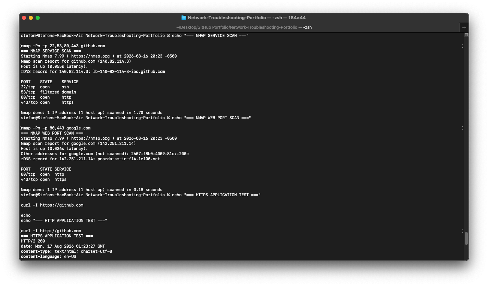
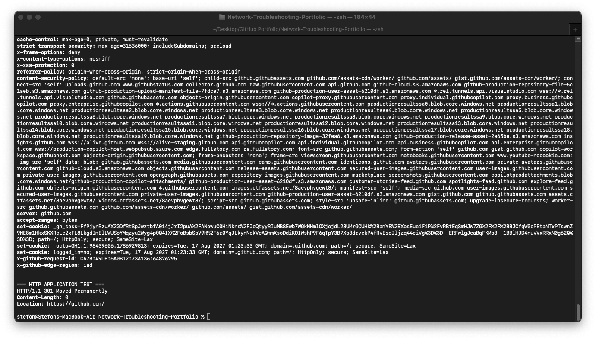

# Scenario 03 — Network Port and Service Testing

## Objective

Test common TCP ports and network services to verify that remote hosts are reachable, determine which services are available, and validate HTTP/HTTPS connectivity at the 
application layer.

## Environment

- Platform: macOS
- Network Interface: Wi-Fi
- Local Network: 192.168.0.0/24
- Default Gateway: 192.168.0.1
- Test Hosts:
  - github.com
  - google.com
  - Local default gateway
- Tools:
  - Netcat (`nc`)
  - Nmap
  - cURL

## Troubleshooting Process

### 1. Test TCP Connectivity with Netcat

Netcat was used to determine whether TCP connections could be established to common service ports.

```bash
nc -vz -w 5 github.com 443
nc -vz -w 5 github.com 80
nc -vz -w 5 google.com 443
nc -vz -w 5 github.com 22
```

The tests verified connectivity to web and SSH services.

The local default gateway was also tested:

```bash
GATEWAY=$(route -n get default | awk '/gateway:/{print $2}')
nc -vz -w 5 "$GATEWAY" 80
nc -vz -w 5 "$GATEWAY" 443
```

This demonstrated how Netcat can quickly determine whether a TCP service accepts connections.

### 2. Scan GitHub Service Ports with Nmap

Nmap was used to inspect several common TCP ports:

```bash
nmap -Pn -p 22,53,80,443 github.com
```

Results:

| Port | State | Service |
|---|---|---|
| 22/tcp | Open | SSH |
| 53/tcp | Filtered | DNS |
| 80/tcp | Open | HTTP |
| 443/tcp | Open | HTTPS |

The scan showed that GitHub was reachable and that SSH, HTTP, and HTTPS were accepting TCP connections.

Port 53 appeared as filtered. A filtered result indicates that Nmap could not determine whether the port was open because network filtering prevented the expected response.

### 3. Scan Google Web Ports

A second Nmap test focused specifically on web services:

```bash
nmap -Pn -p 80,443 google.com
```

Results:

| Port | State | Service |
|---|---|---|
| 80/tcp | Open | HTTP |
| 443/tcp | Open | HTTPS |

Both standard web ports were reachable.

### 4. Test HTTPS at the Application Layer

A successful TCP connection does not by itself prove that the application is functioning correctly.

cURL was therefore used to request HTTP headers from GitHub:

```bash
curl -I https://github.com
```

The HTTPS request returned:

```text
HTTP/2 200
```

An HTTP 200 response indicates that the HTTPS web service successfully processed the request.

### 5. Test Standard HTTP

The unencrypted HTTP service was also tested:

```bash
curl -I http://github.com
```

The server returned:

```text
HTTP/1.1 301 Moved Permanently
Location: https://github.com/
```

This demonstrates that GitHub redirects HTTP traffic to HTTPS.

## Analysis

The tests demonstrate several different layers of network troubleshooting.

Netcat confirmed whether TCP connections could be established to specific destination ports.

Nmap provided additional information about port state and the services normally associated with those ports.

cURL tested the actual HTTP/HTTPS application behavior after network connectivity had already been established.

Using these tools together helps distinguish between:

- General network connectivity problems
- Blocked or filtered ports
- Unavailable services
- Application-layer problems
- Normal HTTP redirects

## Diagnosis

No general connectivity or web-service fault was detected during testing.

The results showed:

- Successful TCP connectivity to common web services
- GitHub SSH connectivity on TCP port 22
- GitHub HTTP connectivity on TCP port 80
- GitHub HTTPS connectivity on TCP port 443
- Google HTTP and HTTPS ports reachable
- GitHub TCP port 53 filtered during the Nmap test
- Successful HTTPS application response
- Normal HTTP-to-HTTPS redirection

## Evidence





## Skills Demonstrated

- TCP/IP troubleshooting
- TCP port testing
- Network service validation
- Netcat usage
- Nmap port scanning
- HTTP/HTTPS troubleshooting
- cURL usage
- Port-state interpretation
- Application-layer testing
- Structured network troubleshooting
- Technical documentation

## Conclusion

The workstation successfully communicated with the tested remote services. Netcat, Nmap, and cURL were used together to validate connectivity from the TCP layer through the 
HTTP/HTTPS application layer.

This scenario demonstrates a structured method for determining whether a reported connectivity problem originates from the network path, TCP port availability, service 
accessibility, or application layer.
