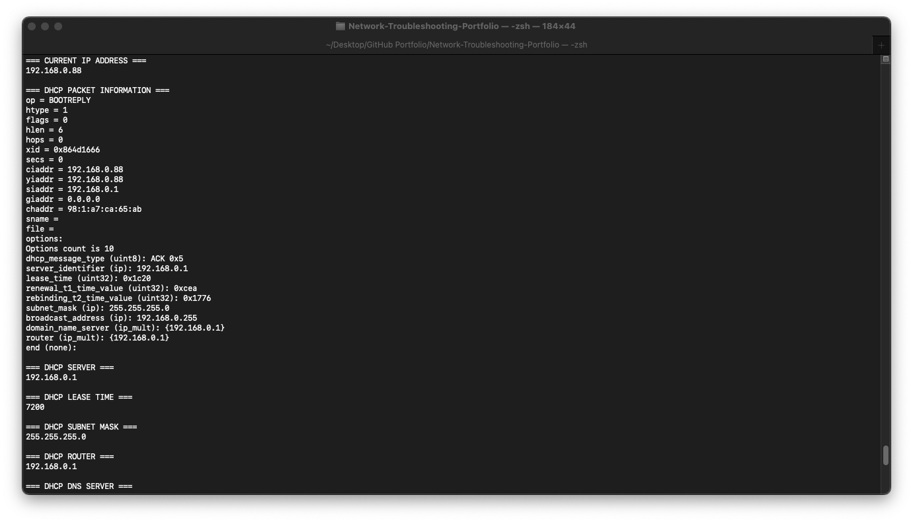
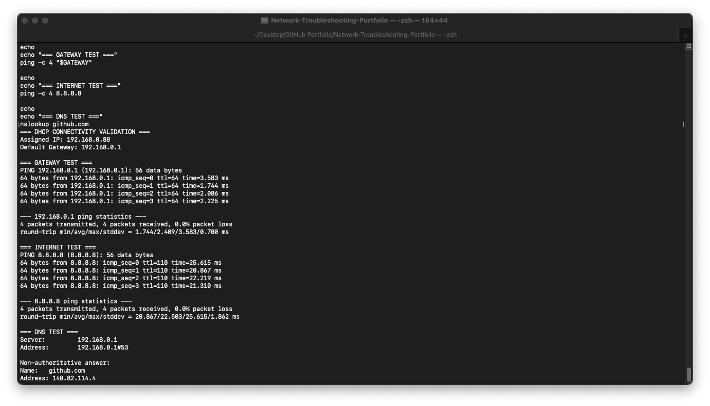

# Scenario 04 — DHCP Troubleshooting

## Objective

Verify that a workstation successfully received its network configuration through DHCP and confirm that the assigned configuration provides local network, Internet, and DNS 
connectivity.

## Environment

- Platform: macOS
- Network Interface: Wi-Fi (`en0`)
- Assigned IPv4 Address: `192.168.0.88`
- Subnet Mask: `255.255.255.0`
- DHCP Server: `192.168.0.1`
- Default Gateway: `192.168.0.1`
- DNS Server: `192.168.0.1`
- DHCP Lease Time: `7200` seconds

## Troubleshooting Process

### 1. Check Current IP Address

The workstation's current IPv4 address was checked using:

```bash
ipconfig getifaddr en0
```

The workstation received:

```text
192.168.0.88
```

This is a valid private IPv4 address on the local network.

### 2. Inspect DHCP Lease Information

DHCP information was inspected using:

```bash
ipconfig getpacket en0
```

The DHCP packet information showed that the workstation successfully received a DHCP ACK.

Important values included:

- DHCP Message Type: ACK
- DHCP Server: `192.168.0.1`
- Assigned Address: `192.168.0.88`
- Subnet Mask: `255.255.255.0`
- Router: `192.168.0.1`
- DNS Server: `192.168.0.1`
- Lease Time: `7200` seconds

The DHCP ACK confirmed that the DHCP negotiation completed successfully.

### 3. Verify DHCP Configuration

Individual DHCP options were checked using:

```bash
ipconfig getoption en0 server_identifier
ipconfig getoption en0 lease_time
ipconfig getoption en0 subnet_mask
ipconfig getoption en0 router
ipconfig getoption en0 domain_name_server
```

The returned configuration was consistent with the active network.

### 4. Test Default Gateway Connectivity

The DHCP-provided default gateway was tested using:

```bash
GATEWAY=$(ipconfig getoption en0 router)
ping -c 4 "$GATEWAY"
```

Result:

- 4 packets transmitted
- 4 packets received
- 0.0% packet loss

This confirmed that the workstation could communicate with the local router.

### 5. Test Internet Connectivity

Internet connectivity was tested directly against a public IP address:

```bash
ping -c 4 8.8.8.8
```

Result:

- 4 packets transmitted
- 4 packets received
- 0.0% packet loss

This confirmed that the workstation could reach the Internet independently of DNS resolution.

### 6. Test DNS Resolution

DNS functionality was tested using:

```bash
nslookup github.com
```

The configured DNS server successfully returned an IP address for `github.com`.

This confirmed that DNS resolution was functioning correctly with the DHCP-provided network configuration.

## Diagnosis

No DHCP fault was detected.

The workstation successfully obtained a valid network configuration through DHCP.

Testing confirmed:

- Valid IPv4 address assignment
- Valid subnet mask
- DHCP ACK received
- DHCP server identified
- Default gateway assigned
- DNS server assigned
- Active DHCP lease
- Successful gateway connectivity
- Successful Internet connectivity
- Successful DNS resolution

The DHCP configuration was functioning normally during testing.

## Evidence





## Skills Demonstrated

- DHCP troubleshooting
- DHCP lease analysis
- IPv4 configuration analysis
- Default gateway validation
- DNS validation
- ICMP connectivity testing
- macOS network administration
- Structured troubleshooting documentation
