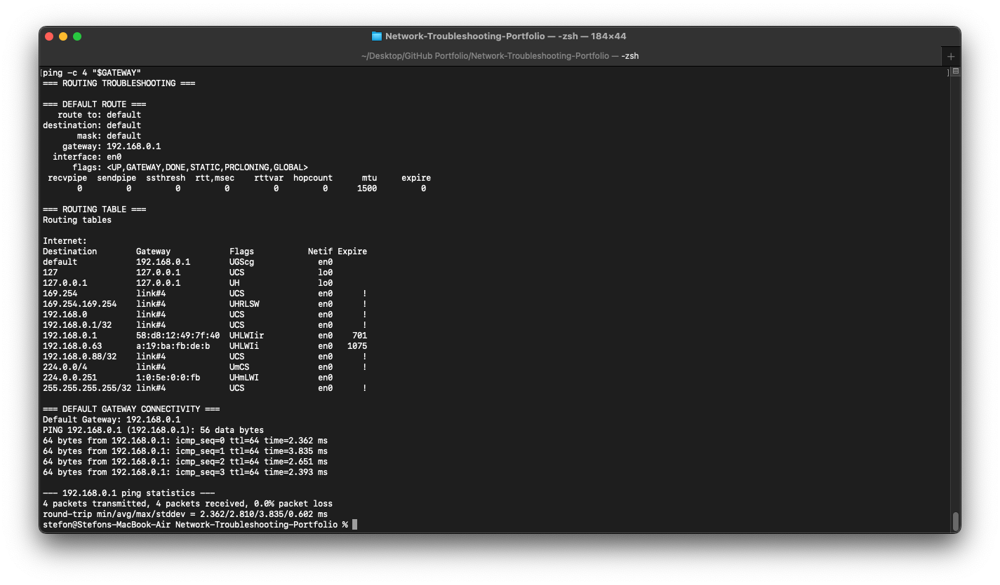
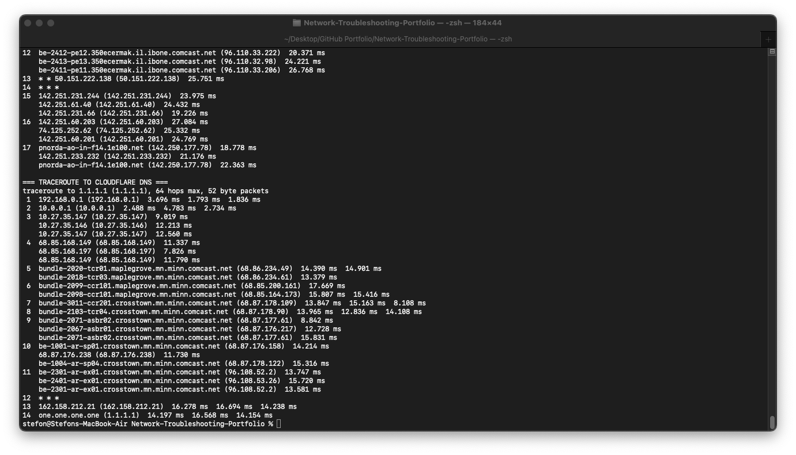

# Scenario 05 — Routing and Traceroute Troubleshooting

## Objective

Verify the workstation's routing configuration, confirm connectivity to the default gateway, and analyze the network path to remote Internet destinations.

## Environment

- Platform: macOS
- Network Interface: Wi-Fi (`en0`)
- Local Network: `192.168.0.0/24`
- Default Gateway: `192.168.0.1`
- Test Destinations:
  - Google
  - Cloudflare DNS (`1.1.1.1`)

## Troubleshooting Process

### 1. Check the Default Route

The system's default route was inspected to determine which gateway and network interface are used for outbound traffic.

```bash
route -n get default
```

The workstation reported:

- Gateway: `192.168.0.1`
- Interface: `en0`
- MTU: `1500`

This confirmed that a valid default route was configured.

### 2. Inspect the IPv4 Routing Table

The IPv4 routing table was reviewed using:

```bash
netstat -rn -f inet
```

The routing table showed a default route through:

```text
192.168.0.1
```

using interface:

```text
en0
```

Local, loopback, and directly connected network routes were also present.

### 3. Test Default Gateway Connectivity

The default gateway was tested using ICMP.

```bash
GATEWAY=$(route -n get default | awk '/gateway:/{print $2}')
ping -c 4 "$GATEWAY"
```

Result:

- 4 packets transmitted
- 4 packets received
- 0.0% packet loss

This confirmed successful Layer 3 connectivity between the workstation and the local router.

### 4. Trace the Route to Google

The route from the workstation to Google was examined using:

```bash
traceroute google.com
```

The trace began at the local gateway and progressed through multiple upstream network routers before reaching Google's network.

This demonstrated that traffic was successfully routed beyond the local network and across the Internet.

### 5. Trace the Route to Cloudflare DNS

A second route test was performed against Cloudflare's public DNS service.

```bash
traceroute 1.1.1.1
```

The trace successfully reached:

```text
one.one.one.one (1.1.1.1)
```

The route passed through the local gateway and multiple upstream network hops before reaching the destination.

### 6. Interpret Unresponsive Hops

Some traceroute hops displayed:

```text
* * *
```

These responses do not automatically indicate a network failure.

Routers may ignore or filter traceroute probes while continuing to forward normal network traffic. Because later hops and the final destinations were successfully reached, these 
intermediate timeouts did not prevent connectivity.

## Diagnosis

No routing fault was detected.

Testing confirmed:

- A valid default route
- A reachable default gateway
- A functioning IPv4 routing table
- Successful routing beyond the local network
- Successful traceroute to remote destinations
- End-to-end Internet path availability

The workstation's routing configuration was functioning normally during testing.

## Evidence





## Skills Demonstrated

- TCP/IP troubleshooting
- Routing table analysis
- Default gateway validation
- ICMP connectivity testing
- Traceroute analysis
- Network path troubleshooting
- macOS network administration
- Structured troubleshooting documentation
