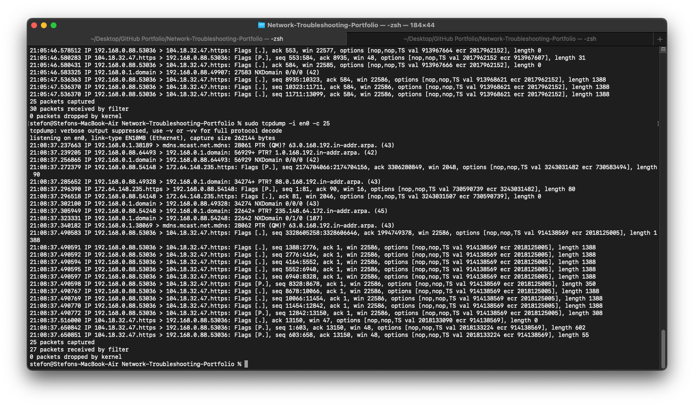
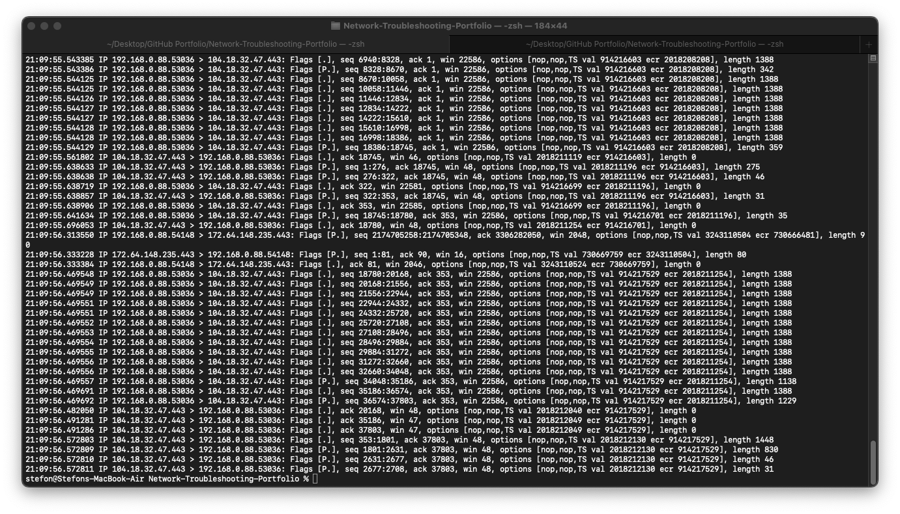

# Scenario 08 — Packet Capture and Traffic Analysis

## Objective

Capture and analyze live network traffic from a workstation to identify network protocols, source and destination addresses, ports, TCP activity, DNS traffic, and ICMP 
connectivity.

The goal of this scenario is to demonstrate how packet capture can be used to investigate network communication and troubleshoot connectivity at the packet level.

## Environment

- Platform: macOS
- Active Network Interface: Wi-Fi (`en0`)
- Local IPv4 Address: `192.168.0.88`
- Default Gateway: `192.168.0.1`
- Capture Tool: `tcpdump`
- Capture Format: PCAP
- Traffic Generated: ICMP, DNS, HTTPS/TCP
- Test Destinations: `8.8.8.8` and `github.com`

## Troubleshooting Process

### 1. Verify the Active Network Interface

Before capturing traffic, the workstation's default network interface was identified.

```bash
route -n get default | grep interface
```

The active interface was confirmed as:

```text
interface: en0
```

This indicated that `en0` should be monitored when capturing the workstation's Wi-Fi network traffic.

### 2. Generate Test Network Traffic

Network traffic was intentionally generated so that different types of communication could be observed during packet capture.

ICMP connectivity was tested using:

```bash
ping -c 4 8.8.8.8
```

The test returned four successful replies with:

```text
4 packets transmitted, 4 packets received, 0.0% packet loss
```

This confirmed basic IP connectivity to an external destination.

DNS traffic was generated using:

```bash
nslookup github.com
```

The query successfully resolved `github.com` through the local DNS server at:

```text
192.168.0.1
```

This demonstrated successful DNS resolution.

HTTPS traffic was also generated by accessing GitHub and using:

```bash
curl -I https://github.com
```

This provided application-layer HTTPS traffic for analysis.

### 3. Capture Live Network Traffic

A live packet capture was started on the active Wi-Fi interface using:

```bash
sudo tcpdump -i en0 -c 25
```

The `-i en0` option instructed `tcpdump` to monitor the Wi-Fi interface.

The `-c 25` option instructed the capture to stop automatically after 25 packets.

The capture successfully completed with:

```text
25 packets captured
27 packets received by filter
0 packets dropped by kernel
```

No packets were reported as dropped by the kernel during the capture.

### 4. Analyze Live Packet Output

The live capture displayed multiple forms of network communication.

Observed traffic included:

- DNS queries and responses
- TCP connections
- HTTPS traffic on TCP port 443
- Local workstation traffic
- Remote Internet traffic
- TCP acknowledgment packets
- TCP packets containing application data

For example, traffic was observed between the local workstation:

```text
192.168.0.88
```

and remote systems using:

```text
https / TCP 443
```

The packet output also displayed TCP information such as:

- Source and destination addresses
- Source and destination ports
- TCP flags
- Sequence numbers
- Acknowledgment numbers
- Window sizes
- Packet payload lengths

### 5. Capture Traffic to a PCAP File

A second packet capture was performed and written to a PCAP file for later analysis.

```bash
sudo tcpdump -i en0 -c 50 -w "Packet-Captures/08-Packet-Capture-and-Traffic-Analysis/network-capture.pcap"
```

This created:

```text
Packet-Captures/08-Packet-Capture-and-Traffic-Analysis/network-capture.pcap
```

Saving packets in PCAP format allows captured traffic to be reviewed later rather than requiring analysis during the live capture.

PCAP files can also be opened by packet-analysis applications such as Wireshark.

### 6. Read the Saved Packet Capture

The saved capture was inspected using:

```bash
tcpdump -nn -r "Packet-Captures/08-Packet-Capture-and-Traffic-Analysis/network-capture.pcap"
```

The `-r` option instructed `tcpdump` to read packets from the saved capture.

The `-nn` option prevented hostname and service-name resolution, allowing raw IP addresses and numeric port numbers to be examined.

The saved traffic showed communication involving the local workstation:

```text
192.168.0.88
```

and remote Internet hosts.

### 7. Identify HTTPS Traffic

A significant amount of captured TCP traffic used destination or source port:

```text
443
```

TCP port 443 is commonly used for HTTPS communication.

The capture therefore demonstrated encrypted web traffic between the workstation and remote servers.

Although the application data itself was encrypted, packet metadata remained visible, including:

- Source IP
- Destination IP
- Source port
- Destination port
- TCP flags
- Sequence numbers
- Acknowledgment numbers
- Packet lengths

This demonstrates how packet captures remain useful for troubleshooting encrypted connections even when application payload contents cannot be directly inspected.

### 8. Interpret TCP Flags

The captured packets contained several TCP flag indicators.

Examples included:

```text
Flags [.]
Flags [P.]
```

`Flags [.]` indicates an ACK packet.

`Flags [P.]` indicates the PSH and ACK flags are set, commonly showing that application data is being delivered as part of an established TCP connection.

Sequence and acknowledgment numbers were also visible, demonstrating TCP's reliable connection-oriented communication.

### 9. Correlate Packet Capture With Connectivity Tests

The packet capture results were compared with the earlier connectivity tests.

The workstation successfully:

- Reached `8.8.8.8` using ICMP
- Resolved `github.com` using DNS
- Established Internet TCP connections
- Communicated with remote systems using HTTPS
- Received return traffic from remote hosts

These results demonstrate connectivity across several layers of the network stack.

## Findings

Packet capture confirmed that the workstation was actively transmitting and receiving network traffic through `en0`.

The analysis demonstrated:

- Functional IP connectivity
- Functional DNS resolution
- Successful external communication
- Active TCP sessions
- HTTPS traffic over TCP port 443
- Successful packet transmission and reception
- No kernel packet drops during the 25-packet live capture
- Successful creation and reading of a PCAP file

The local workstation address `192.168.0.88` appeared throughout the captured traffic, allowing local communication to be distinguished from remote traffic.

## Diagnosis

No packet-level connectivity failure was detected during testing.

The workstation successfully communicated with local and remote network services.

DNS queries received responses, external IP connectivity was available, and TCP/HTTPS sessions were active.

The packet capture provided evidence that the workstation's network stack and active Wi-Fi interface were successfully sending and receiving traffic.

## Troubleshooting Value

Packet capture is particularly useful when basic tools such as `ping`, `nslookup`, or `traceroute` do not provide enough information to identify a network problem.

A packet capture can help investigate issues such as:

- DNS failures
- TCP connection failures
- Connection resets
- Retransmissions
- Unexpected network traffic
- Firewall filtering
- Application connectivity problems
- Slow network communication
- Missing responses from remote systems

Capturing traffic provides direct evidence of what is entering and leaving a network interface.

## Evidence





## Skills Demonstrated

- Packet capture
- `tcpdump` usage
- PCAP creation
- PCAP analysis
- Network traffic analysis
- TCP/IP troubleshooting
- TCP flag interpretation
- Port identification
- HTTPS traffic identification
- DNS traffic analysis
- ICMP connectivity testing
- Source and destination IP analysis
- Network interface monitoring
- macOS network troubleshooting
- Command-line diagnostics
- Structured technical documentation

## Conclusion

Packet-level analysis confirmed that the workstation was successfully communicating across the network through the `en0` Wi-Fi interface.

Live traffic was captured with `tcpdump`, network activity was generated using ICMP, DNS, and HTTPS tests, and a persistent PCAP file was created for offline analysis.

The captured traffic demonstrated active TCP sessions, HTTPS communication on port 443, DNS activity, and communication between the local workstation and remote Internet systems.

This scenario demonstrates the ability to move beyond basic connectivity testing and inspect network communication directly at the packet level.
